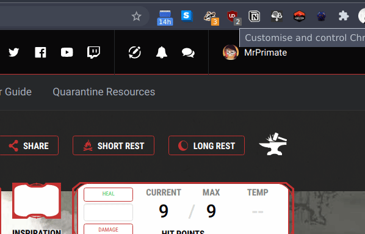
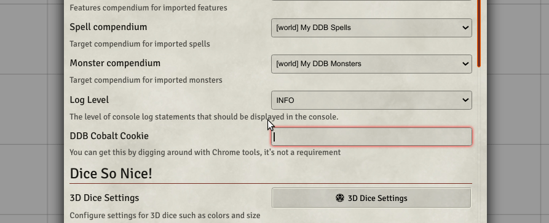

# DDB-Importer Firefox Extension

This is a Firefox port of [MrPrimate's DDB-Importer Chrome Extension](https://github.com/MrPrimate/ddb-importer-chrome), forked and adapted for Firefox by [RadagastIRL](https://github.com/RadagastIRL).

This extension is a helper for [MrPrimate's DDB-Importer](https://github.com/mrprimate/ddb-importer) Foundry VTT module. **The extension is not useful on its own** — you will need the DDB-Importer module installed in Foundry VTT for it to do anything meaningful.

It helps you extract the dndbeyond.com Cobalt Session token used for authentication against the D&D Beyond API endpoints.

## Install

1. Download or clone this repository
2. Open Firefox and navigate to `about:debugging`
3. Click **"This Firefox"** in the left sidebar
4. Click **"Load Temporary Add-on..."**
5. Navigate to the extension folder and select `manifest.json`

## Usage

## Credits

- Original Chrome extension by [MrPrimate](https://github.com/MrPrimate) — [ddb-importer-chrome](https://github.com/MrPrimate/ddb-importer-chrome)
- DDB-Importer Foundry VTT module by [MrPrimate](https://github.com/MrPrimate) — [ddb-importer](https://github.com/mrprimate/ddb-importer)
